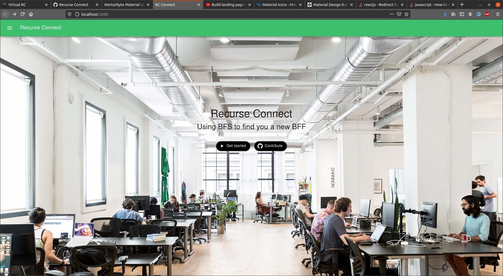

<h1 align="center">Recurse Connect</h1>

<h2 align="center"><i>Using BFS to find you a new BFF!</i></h2>

<p align="center">
  <a href="https://golang.org/doc/go1.15">
     
  <a href="https://opensource.org/licenses/MIT">
    
  <a>
    
</p>
    
Recurse Connect is a social networking platform designed for and by the [Recurse Center](https://recurse.com) community. Using the Recurse API, Recurse Connect creates weighted network graphs connecting participants based on time spent at RC. Users can query for likeminded participants using a variety of factors and visualize various pathfinding algorithms, including DFS, BFS, Dijsktra's, and A*, to determine the necessary people to talk to in order to make a new connection!

Recurse Connect is primarily written in Go on the backend with React and TypeScript making up the frontend. The application is hosted on Google Cloud App Engine.

## Table of Contents

- [Contributing](#Contributing)
- [Credits](#Credits)
- [License](#License)

## Contributing

Although clocviz was designed as an educational project, any contributions or suggestions are greatly appreciated! If you would like to contribute to the codebase, please follow these steps:

```
1. Create an issue
2. Fork the repo
3. Create a branch*
4. Make your changes
5. Write unit tests as applicable
6. Format the codebase using 'go fmt'*
7. Ensure that your changes passes all tests using 'go test'
8. Squash your changes to as few commits as possible*
9. Make a pull request*
```

<i>\*Please use the issue number and name when possible to improve clarity and project maintainability (i.e. "134-AddTernaryOperator"). Additionally, please adhere to [Conventional Commits](https://www.conventionalcommits.org/en/v1.0.0/) standards.<br></i>

## Credits

This project would not have have been possible without the entire Recurse Center community. From the actual API to the aid of various individuals in the form of pair programming, this project is very much the project designed and implemented by Recursers.

## License

The Recurse Connect project is licensed under the MIT License Copyright (c) 2021.

See the [LICENSE](https://github.com/cdkini/recurse-connect/LICENSE) for information on the history of this software, terms & conditions for usage, and a DISCLAIMER OF ALL WARRANTIES.

All trademarks referenced herein are property of their respective holders.
